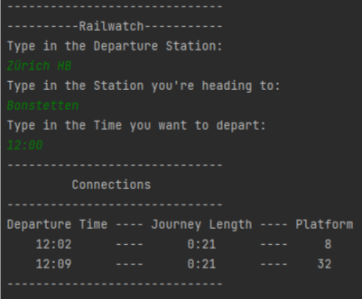
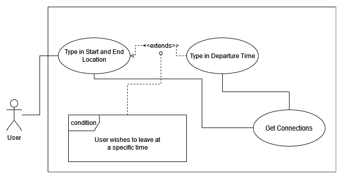
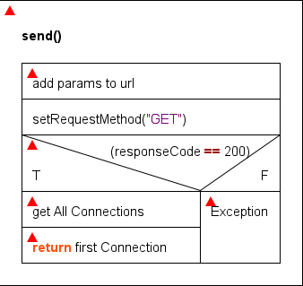
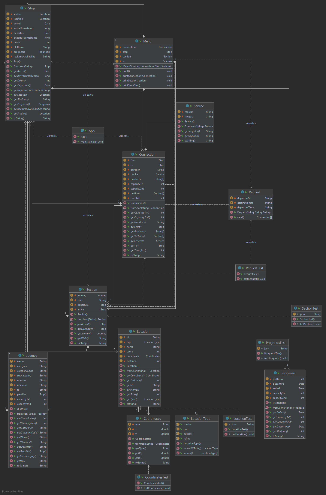
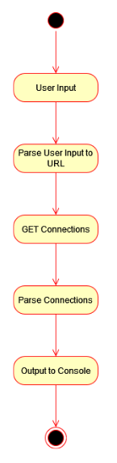

# Railwatch

## Funktionsbeschreibung

Wir wollen eine Terminal-App realisieren, die mithilfe einer API Zugverbindungen auflisten soll.

[https://transport.opendata.ch/](https://transport.opendata.ch/)

Das ist die API, die wir benutzen werden. Ein User muss die Startstation und die Zielstation und freiwillig noch die Uhrzeit angeben, danach werden ihm die nächsten Verbindungen angezeigt. Wir werden diese App in Java entwickeln.

Schlussendlich soll die App so aussehen:



## Diagramme

### Use Case



### Struktogramm



### Klassendiagramm



### Aktivitätsdiagramm



## Testprotokoll

### Funktionstests

### Unit Tests

**Coordinates**: AssertEquals mit Getter überprüfen

| JSON Attribut | Eingabe   | Erwartet | Tatsächlich | OK/NOK |
| ------------- | --------- | -------- | ----------- | ------ |
| id            | WGS84     | Passed   | Passed      | OK     |
| Coordinate X  | 47.391361 | Passed   | Passed      | OK     |
| Coordinate Y  | 8.051284  | Passed   | Passed      | OK     |

**Location**: AssertEquals mit Getter überprüfen

| JSON Attribut   | Eingabe   | Erwartet | Tatsächlich | OK/NOK |
| --------------- | --------- | -------- | ----------- | ------ |
| id              | 8502113   | Passed   | Passed      | OK     |
| name            | Aarau     | Passed   | Passed      | OK     |
| score           | null      | Passed   | Passed      | OK     |
| Coordinate Type | WGS84     | Passed   | Passed      | OK     |
| Coordinate X    | 47.391361 | Passed   | Passed      | OK     |
| Coordinate Y    | 8.051284  | Passed   | Passed      | OK     |
| distance        | null      | Passed   | Passed      | OK     |

**Location**: AssertEquals mit Getter überprüfen

| JSON Attribut | Eingabe                   | Erwartet | Tatsächlich | OK/NOK |
| ------------- | ------------------------- | -------- | ----------- | ------ |
| platform      | 10                        | Passed   | Passed      | OK     |
| arrival       | 2022-03-31T08:58:00+02:00 | Passed   | Passed      | OK     |
| departure     | 2022-03-31T09:00:00+02:00 | Passed   | Passed      | OK     |
| Capacity1st   | 0                         | Passed   | Passed      | OK     |
| Capacity2nd   | -1                        | Passed   | Passed      | OK     |

**Section**: AssertNull mit Getter überprüfen

| JSON Attribut | Eingabe | Erwartet | Tatsächlich | OK/NOK |
| ------------- | ------- | -------- | ----------- | ------ |
| walk          | null    | Passed   | Passed      | OK     |

## Nutzung

### Voraussetzungen

- Maven 3.8
- Java 17
- Internetverbindung

### Applikation ausführen

```bash
mvn clean
mvn package
mvn exec:java
```

### Tests ausführen

```bash
mvn test
```
